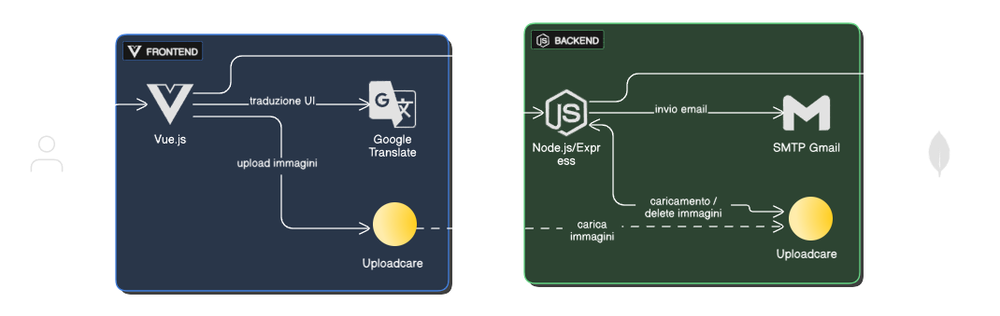

# Trento101

## Overview

Trento101 è una piattaforma digitale centralizzata per facilitare la vita a Trento, rivolta a cittadini, aziende e amministrazione locale. L'applicazione semplifica l'accesso alle informazioni, promuove i servizi locali e raccoglie feedback tramite sondaggi.

## Project Goals

- **Migliorare l'esperienza utente** semplificando l'accesso ai servizi essenziali di città e università.
- **Supportare l'economia locale** dando visibilità a imprese e servizi.
- **Favorire decisioni data-driven** tramite sondaggi e insight degli utenti.

## Deployment Diagram (Componenti Interni ed Esterni)

- **Frontend**: SPA Vue.js, comunica solo tramite API REST con il backend. Integra Google Translate Widget per la traduzione automatica e Uploadcare per l'upload immagini.
- **Backend**: Node.js/Express, espone API RESTful per autenticazione, aziende, news, servizi, supporto, sondaggi, statistiche, ecc. Gestisce invio email tramite SMTP Gmail e interagisce con Uploadcare e MongoDB Atlas.
- **Componenti esterni**: SMTP Gmail (backend), Uploadcare (frontend/backend), Google Translate Widget (frontend).

## Stack tecnologico utilizzato

### Frontend
- Vue.js 3
- Vite
- Pinia
- Vue Router
- Tailwind CSS
- Axios
- Chart.js, vue-chartjs
- Uploadcare
- Google Translate Widget

### Backend
- Node.js
- Express.js
- Mongoose (ODM per MongoDB)
- JWT (autenticazione)
- Express-validator
- Nodemailer (SMTP Gmail)

### Database
- MongoDB Atlas (cloud)

## Funzionalità principali
- Autenticazione e gestione sessioni (JWT)
- Gestione aziende (CRUD)
- Gestione news (CRUD)
- Gestione servizi (comune e università)
- Gestione richieste di supporto (cittadini e aziende)
- Gestione sondaggi
- Statistiche e logging
- Verifica email (incluso invio email tramite SMTP)
- Traduzione automatica dell'interfaccia (Google Translate)

## Contributors

- David Brugnara
- Marko Markovic
- Alessio De Col
